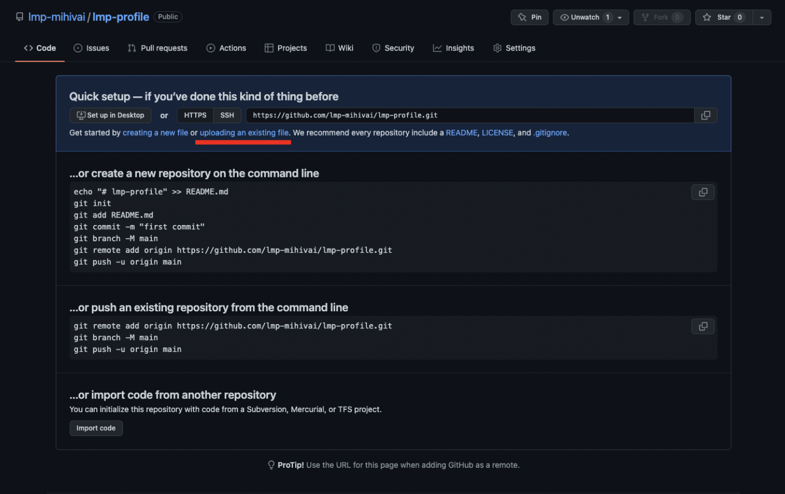
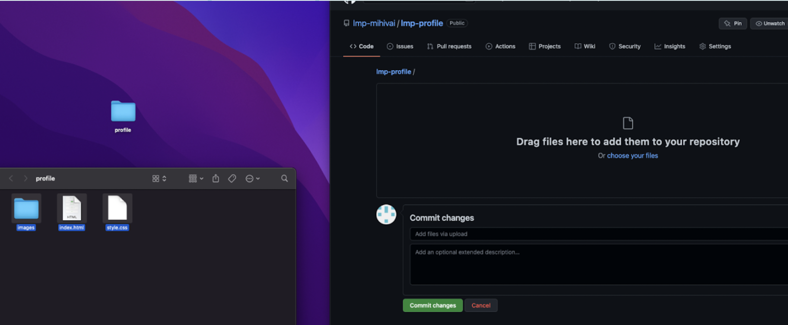
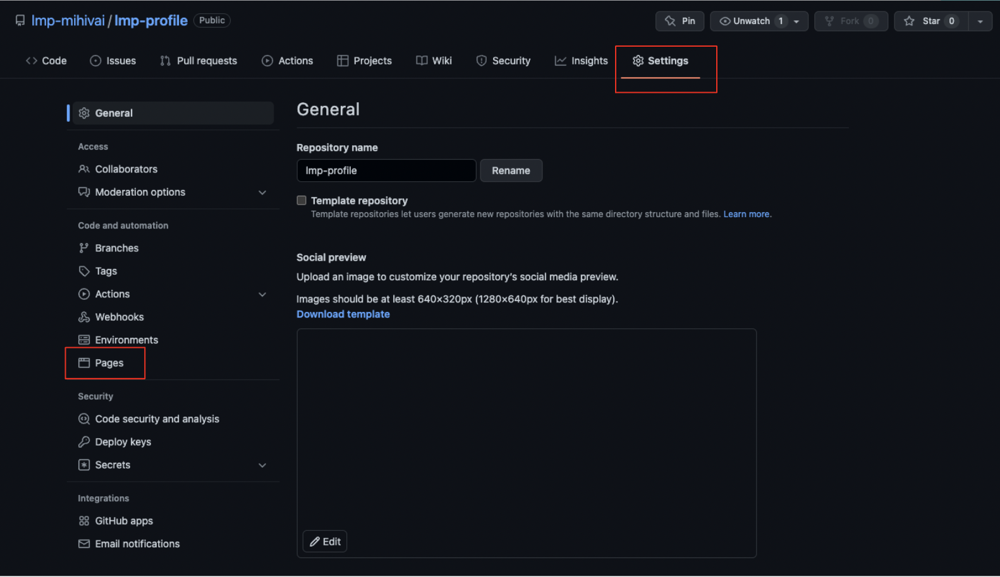
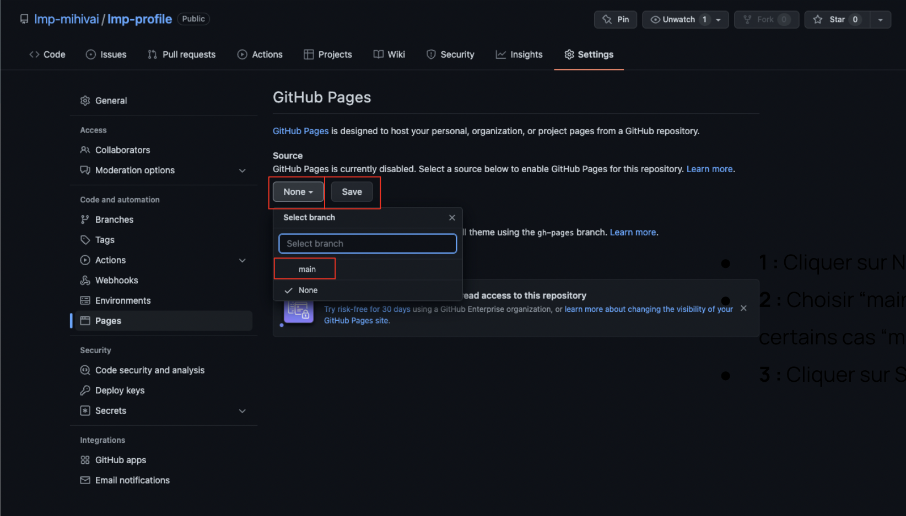

# Déployer son site Static sur GitHub pages

### <a href="https://github.com/Joz84/ten-hours-of-html-css" target="_blank"> Retour au menu principal </a>

## Les diapositives
Les diapositives de ce guide sont disponibles sur le lien suivant :
<a href="https://docs.google.com/presentation/d/16VjsjILJwrdNkOHb24jaxNthKQTVKpEDO1LLEmA7eSw/edit?usp=sharing" target="_blanck">
Deploy to GitHub (slides) </a>

### Étape 1 : Créer un compte GitHub 

Tout d'abord il faut créer un compte GitHub en se rendant à l'adresse suivante : 

### Étape 2 : Créer un repository GitHub 

Il faut maintenant créer un repository GitHub. Un repository est un espace de stockage pour votre code qui sera en mesure de gérer simultanément plusieurs version de votre code. 

Une fois connecté, créez un repository depuis la page d'accueil comme sur l'image ci-dessous. 

Dans le formulaire de création du repository : 
* Choisir un nom pour le repository
* La description est optionnelle 
* Garder le repository en “public”, cela est obligatoire pour le déploiement
* Le README, le .gitignore et la license ne sont pas nécessaires. 

### Étape 3 : Uploader le code 

Une fois le repositoy créé vous arriverez sur la page de ce dernier. Ce dernier est vide, ce qui est normal, et vous devriez donc voir à peu près la même chose que sur l'image ci-dessous : 

Comme sur l'image, il faut cliquer sur "upload existing file". Une nouvelle va fenêtre et vous aurez la possibilité de faire glisser votre code en drag and drop. Veillez à bien sélectrionner et uploader l'ensemble des fichiers qui sont dans le dossier de votre projet. 

### Étape 4 : Mise en ligne 

Une fois que vous avez uploadé tous vos fichers, rendez-vous dans les paramètres de votre repository comme sur l'image ci-dessous. Rendez-vous dans la section "Pages". 

Une fois sur la bonne page, suivez les instructions suivantes comme sur l'image ci-dessous : 
* Cliquer sur none 
* Choisir main ("master" dans certains cas)
* Cliquer sur save 

### Étape 4-bis : Déploiement du site 

Une fois que vous aurez enregistré les paramètres de l'étape précédente, vous devriez arriver sur une page qui contient l'élément suivant : 

Votre site sera bientôt en ligne ! N’hésitez pas à rafraîchir la page pour voir quand le site sera publié, cela peut prendre quelques minutes. 

Le bandeau vert indique que votre site est en ligne, félicitations ! 🎉
Pour le consulter, il suffit de cliquer sur le lien. 

*NB :* Si au bout de 10 minutes le site n’est pas en ligne, revenir à la slide précédente et choisir “none” comme source. Actualiser la page puis remettre “main” comme source. 

